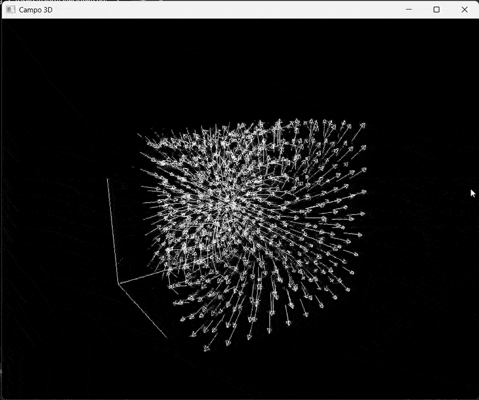

# 📊 Visualizador 3D de Campos Vetoriais

🔹 **Descrição breve**  
  
> Renderiza visual de campos vetoriais em 3D usando OpenGL/GLFW, com câmera orbital controlável por teclado.

## 🚀 **Funcionalidades**  
- Renderização 3D representando direção e magnitude do campo.
- Controle de Câmera Orbital.
- Visualição 3D do campo vetorial em X, Y, Z

## 📦 **Pré-requisitos**  
- OpenGL 3.3+
- GLFW
- GLM

## 🕹️ **Controles**
- ← → ↑ ↓: Teclas direcionais: Rotacionar câmera
- +/-: Zoom in/out
- ESC: Sair

## 🎥 Demonstração Interativa
- ### 📹 Vídeo Demonstrativo (YouTube)
[video youtube campo3D](https://youtu.be/Gr2EPdGQ6fE)

- ### 🎮 Preview Rápido

## ⚙️ **Instalação**  
Passos para configurar o projeto localmente:  

### 1. Clone o repositório:
-  git clone https://github.com/brieu2332/IFIS.git
  
### 2. Compile e execute no seu termial.
- g++ Main.cpp -lglfw -lGL -ldl -o campo3d
- ./campo3d
    
